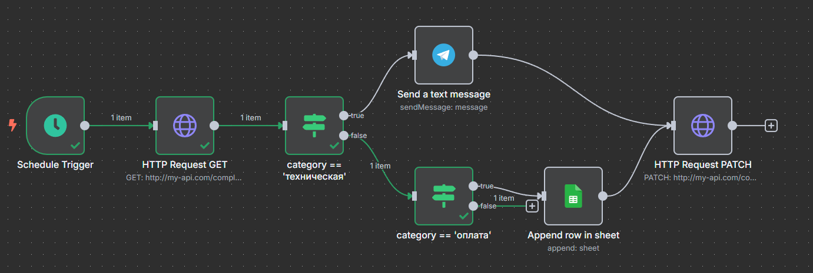

# Установка и запуск

Клонирование и переход в директорию проекта
```bash
git clone https://github.com/bigit22/DiamantVisionTask.git
cd DiamantVisionTask
```

Создание виртуального окружения
```bash
python -m venv venv
```

Активация виртуального окружения
```bash
.\venv\Scripts\activate
```

Установка зависимостей
```bash
pip install -r requirements.txt
```

Настройка переменных окружения
```bash
SENTIMENT_ANALYSIS_URL=https://api.promptapi.com/sentiment/analysis
DATABASE_URL=sqlite+aiosqlite:///./db.sqlite3
APILAYER_API_KEY=
MISTRAL_API_KEY=

```

Запуск приложения
```bash
python main.py
```

Запуск тестов
```bash
pytest
```

# n8n


